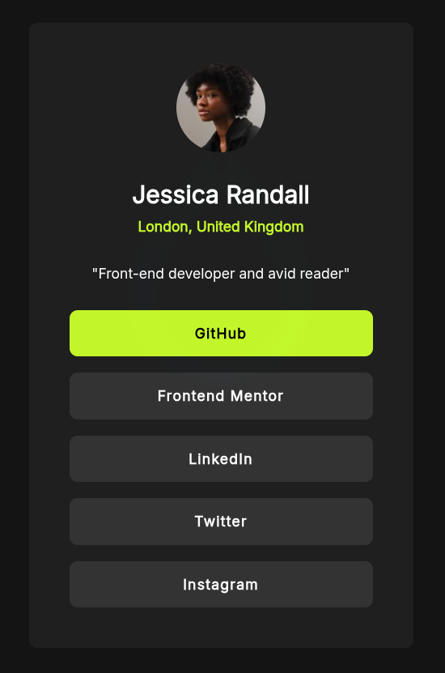

# Frontend Mentor - Social links profile solution

This is a solution to the
[Social links profile challenge on Frontend Mentor](https://www.frontendmentor.io/challenges/social-links-profile-UG32l9m6dQ).

## Table of contents

- [Overview](#overview)
  - [The challenge](#the-challenge)
  - [Screenshot](#screenshot)
  - [Links](#links)
- [My process](#my-process)
  - [Built with](#built-with)
  - [What I learned](#what-i-learned)
  - [Continued development](#continued-development)
- [Author](#author)

## Overview

### The challenge

Users should be able to:

- See hover and focus states for all interactive elements on the page

### Screenshot



### Links

- Solution URL:
  [Solution](https.www.frontendmentor.io/solutions/social-links-profile-main-lY4Cj31a_c)
- Live Site URL:
  [https://frontendmentor-projects.pages.dev/projects/social-links-profile/](https://frontendmentor-projects.pages.dev/projects/social-links-profile/)

## My process

### Built with

- Semantic HTML5 markup
- CSS custom properties
- Flexbox
- [Astro](https://astro.build)
- Mobile-first workflow

### What I learned

I continued to practice my CSS skills, particularly using BEM-style naming
conventions to keep my styles organized and reusable.

```css
.card__list {
  list-style: none;
  display: flex;
  flex-direction: column;
  gap: var(--size-3);
  inline-size: 100%;
}
```

### Continued development

I want to continue focusing on creating reusable components and exploring more
advanced CSS techniques like CSS Grid for layout. I also want to get more
comfortable with Astro's features.

## Author

- Website - [Justin Scopelleti](https://justin-scopelleti.com/)
- Frontend Mentor - [@Kesmek](https://www.frontendmentor.io/profile/Kesmek)
