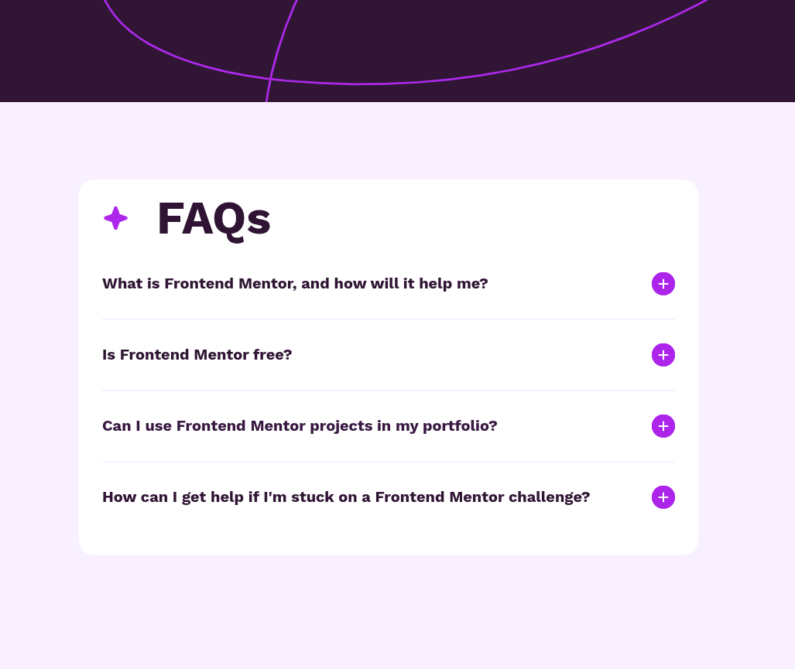

# Frontend Mentor - FAQ accordion solution

This is a solution to the [FAQ accordion challenge on Frontend Mentor](https://www.frontendmentor.io/challenges/faq-accordion-wyfFdeBwBz). Frontend Mentor challenges help you improve your coding skills by building realistic projects.

## Table of contents

- [Overview](#overview)
  - [The challenge](#the-challenge)
  - [Screenshot](#screenshot)
  - [Links](#links)
- [My process](#my-process)
  - [Built with](#built-with)
  - [What I learned](#what-i-learned)
  - [Implementation notes](#implementation-notes)
- [Review](#review)
  - [What I'm most proud of](#what-im-most-proud-of)
  - [What I would do differently](#what-i-would-do-differently)
  - [Challenges I overcame](#challenges-i-overcame)
- [Author](#author)

## Overview

### The challenge

Users should be able to:

- Hide/Show the answer to a question when the question is clicked
- Navigate the questions and hide/show answers using keyboard navigation alone
- View the optimal layout for the interface depending on their device's screen size
- See hover and focus states for all interactive elements on the page

### Screenshot



### Links

- Solution URL: [Add solution URL here](https://www.frontendmentor.io/solutions/)
- Live Site URL: [https://frontendmentor-projects.pages.dev/projects/faq-accordion/](https://frontendmentor-projects.pages.dev/projects/faq-accordion/)

## My process

### Built with

- Semantic HTML5 markup (`<details>`, `<summary>`)
- CSS custom properties and design tokens
- CSS nesting for component organization
- `@property` for animatable custom properties
- `::details-content` pseudo-element for content animation
- Container queries for responsive design
- Mobile-first workflow
- [Astro](https://astro.build/) - Web Framework

### What I learned

This project showcases several advanced CSS techniques for creating an accessible, animated accordion without JavaScript. The native `<details>` and `<summary>` elements provide built-in keyboard navigation and ARIA support.

The icon animation uses a creative approach with CSS-only plus/minus icons created using `border-image` and `box-shadow`:

```css
.summary-icon {
  --c: oklch(0.58 0.27 311.26);
  --inset-amount: 7px;
  --plus-width: calc(50% - (var(--inset-amount) / 10));

  block-size: var(--size-5);
  aspect-ratio: 1;
  box-shadow: 0 0 0 var(--inset-amount) inset var(--c);
  border-image: conic-gradient(var(--c) 0 0) 50% / var(--plus-width);
  clip-path: circle();
}
```

The plus icon transforms into a minus by rotating 90 degrees and changing color:

```css
.faq-details[open] .summary-icon {
  --c: var(--faq-purple-950);
  rotate: 90deg;
}
```

### Implementation notes

- **Native `<details>` element**: Provides built-in accessibility with keyboard navigation and screen reader support
- **`::details-content` pseudo-element**: Enables smooth height animations when expanding/collapsing content
- **`@property --c`**: Registers the color custom property to enable smooth color transitions
- **Container queries**: Responsive background images adjust based on container width rather than viewport
- **CSS-only icons**: Plus/minus icons created entirely with `border-image` and `box-shadow`, scaling dynamically with the icon size
- **Logical properties**: Uses `inline-size` and `block-size` instead of `width` and `height` for better internationalization support
- **CSS cascade layers**: Organizes styles with `@layer components` for predictable specificity

## Review

### What I'm Most Proud Of

- **CSS-only icon implementation**: Successfully used an animated plus/minus icon entirely with CSS using creative combinations of `border-image` and `box-shadow`. The icon scales dynamically and transitions smoothly without requiring any images or icon fonts. The transformation from plus to minus using a simple 90-degree rotation is elegant and performant.

- **Zero JavaScript accordion**: Leveraged the native `<details>` and `<summary>` elements to create a fully functional, accessible accordion without any JavaScript. This provides built-in keyboard navigation, screen reader support, and progressive enhancement.

- **Modern CSS animations**: Successfully implemented smooth content expansion animations using the cutting-edge `::details-content` pseudo-element with `transition-behavior: allow-discrete`, enabling transitions on properties that traditionally couldn't be animated.

- **Registered custom properties**: Used `@property` to register the `--c` color custom property, making it animatable for smooth color transitions throughout the component.

### What I Would Do Differently

- **Hardcoded values**: Some calculations use hardcoded pixel values (like `calc(50% - 15px)`) that prevent the icon from scaling properly. Using relative units or CSS custom properties throughout would improve flexibility.

### Challenges I Overcame

- **Challenge: Animating custom properties**
  - Expected `--c` to animate automatically but color changes were instant
  - Learned that custom properties need to be registered with `@property` to be animatable
  - Solution: Added `@property --c` declaration with syntax and inherits properties to enable smooth color interpolation

- **Challenge: Smooth content expansion**
  - Traditional height transitions from 0 to auto don't work smoothly
  - Discovered the new `::details-content` pseudo-element designed specifically for this use case
  - Solution: Used `::details-content` with `transition-behavior: allow-discrete` to enable smooth expansion animations on the details element

## Author

- Website - [Justin Scopelleti](https://justin-scopelleti.com/)
- Frontend Mentor - [@Kesmek](https://www.frontendmentor.io/profile/Kesmek)
