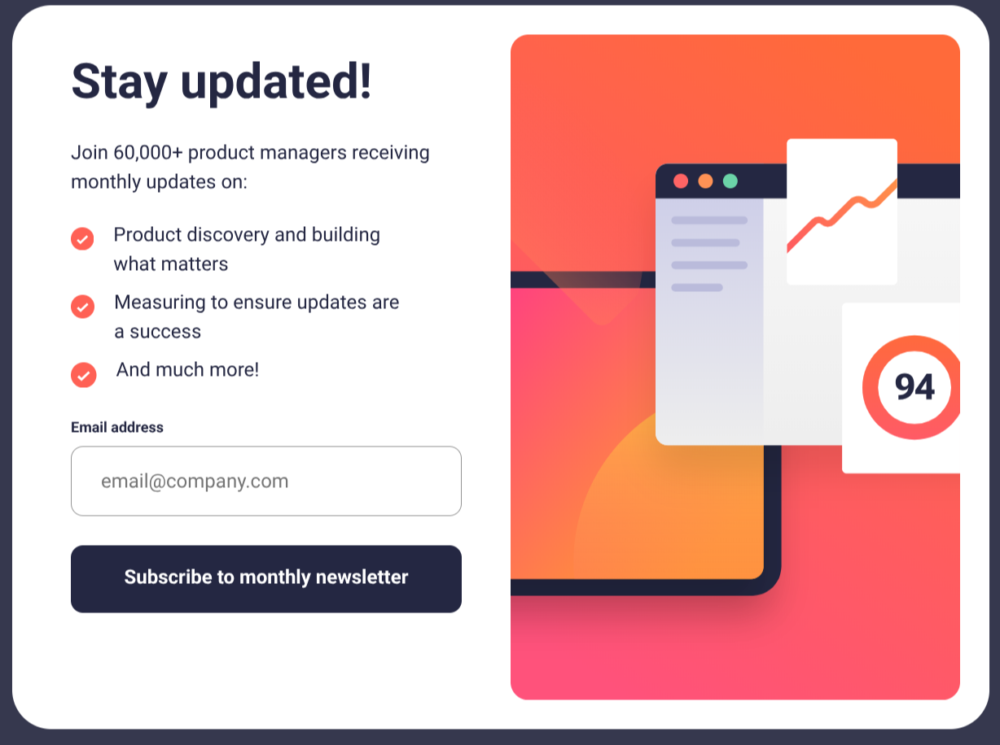

# Frontend Mentor - Newsletter sign-up form with success message solution

This is a solution to the
[Newsletter sign-up form with success message challenge on Frontend Mentor](https://www.frontendmentor.io/challenges/newsletter-signup-form-with-success-message-3FC1AZbNrv).
Frontend Mentor challenges help you improve your coding skills by building
realistic projects.

## Table of contents

- [Overview](#overview)
  - [The challenge](#the-challenge)
  - [Screenshot](#screenshot)
  - [Links](#links)
- [My process](#my-process)
  - [Built with](#built-with)
  - [What I learned](#what-i-learned)
- [Author](#author)

## Overview

### The challenge

Users should be able to:

- Add their email and submit the form
- See a success message with their email after successfully submitting the form
- See form validation messages if:
  - The field is left empty
  - The email address is not formatted correctly
- View the optimal layout for the interface depending on their device's screen
  size
- See hover and focus states for all interactive elements on the page

### Screenshot



### Links

- Solution URL:
  [Add solution URL here](https://www.frontendmentor.io/solutions/)
- Live Site URL:
  [https://frontendmentor-projects.pages.dev/projects/newsletter-sign-up-with-success-message/](https://frontendmentor-projects.pages.dev/projects/newsletter-sign-up-with-success-message/)

## My process

### Built with

- Semantic HTML5 markup
- CSS custom properties
- CSS Grid
- Container queries
- Mobile-first workflow
- BEM methodology
- [Astro](https://astro.build/) - Web Framework
- TypeScript - Form validation logic
- Native HTML5 form validation
- Native `<dialog>` element

### What I learned

This project was an excellent opportunity to explore native HTML5 form
validation and the modern `<dialog>` element for modal interactions.

#### Native Form Validation with Custom Messages

Instead of using a validation library, I implemented form validation using the
browser's native Constraint Validation API. This approach leverages HTML5
validation attributes while providing custom error messages for a better user
experience.

The key was building a reusable validation system that maps validity states to
custom messages:

```typescript
const getCustomErrorMessage = (field: HTMLInputElement): string => {
  const validity = field.validity;
  const fieldName = field.name;
  const messages = fieldMessages[fieldName] || {};

  if (validity.valueMissing) {
    return messages.valueMissing || defaultMessages.valueMissing!;
  }
  if (validity.typeMismatch) {
    return messages.typeMismatch || defaultMessages.typeMismatch!;
  }
  // ... other validity checks
  return "";
};
```

This pattern provides several advantages:

- **Zero dependencies** - Uses browser APIs for validation
- **Progressive enhancement** - Falls back to native validation if JavaScript
  fails
- **Accessible** - Automatically manages ARIA attributes for screen readers
- **Customizable** - Field-specific error messages via configuration object

```typescript
const fieldMessages: Record<string, ErrorMessages> = {
  email: {
    valueMissing: "Email address is required",
    typeMismatch: "Valid email required",
  },
};
```

#### Accessible Error Display

The validation system dynamically manages accessibility attributes to ensure
screen readers can announce errors:

```typescript
const showFieldError = (field: HTMLInputElement, message: string): void => {
  errorElement.textContent = message;
  field.setAttribute("aria-invalid", "true");
  if (errorElement.id) {
    field.setAttribute("aria-describedby", errorElement.id);
  }
};
```

#### Native Dialog Element

The success message uses the native `<dialog>` element, which provides built-in
modal functionality without JavaScript libraries:

```html
<dialog class="newsletter__success" id="newsletter__success">
  <h2>Thanks for subscribing!</h2>
  <p>
    A confirmation email has been sent to
    <b class="newsletter__success-email"></b>.
  </p>
  <button commandfor="newsletter__success" command="close">
    Dismiss message
  </button>
</dialog>
```

The dialog is controlled using the `showModal()` method, which:

- Renders in the top layer (above all other content)
- Traps focus within the dialog
- Closes on ESC key automatically
- Provides a `::backdrop` pseudo-element for styling

```javascript
dialog.showModal(); // Opens as modal
dialog.close(); // Closes dialog
```

I also experimented with the proposed `commandfor` and `command` attributes for
declarative dialog control, though these required a polyfill for browser
compatibility, which I included.

#### Container Queries for Responsive Layout

Instead of media queries, I used container queries to make the component
responsive based on its own size rather than the viewport:

```css
@container (inline-size > 50rem) {
  .newsletter {
    grid-template-columns: 1fr 1fr;
  }

  .newsletter__hero {
    display: none;
  }

  .newsletter__hero--desktop {
    display: block;
  }
}
```

This makes the component truly reusable - it adapts to its container size rather
than the viewport, making it work correctly in any layout context.

#### Real-time Validation UX

The form provides multiple validation touchpoints for optimal user experience:

- **On blur** - Validates when user leaves a field (if they've entered data)
- **On input** - Clears errors as user types to correct mistakes
- **On submit** - Final validation with focus management to first invalid field

```javascript
// Clear errors when user starts typing
form.addEventListener("input", (event) => {
  const field = event.target as HTMLInputElement;
  clearFieldError(field);
});

// Validate on blur if field has value
form.addEventListener("blur", (event) => {
  const field = event.target as HTMLInputElement;
  if (field.value) {
    validateField(field);
  }
}, true);
```

Key learnings:

- Using the Constraint Validation API (`validity` object) for robust form
  validation
- Managing ARIA attributes dynamically for accessibility
- Leveraging native `<dialog>` element for modals
- Container queries for truly responsive components
- Event delegation with capture phase for better performance
- Progressive enhancement patterns that work without JavaScript

## Author

- Website - [Justin Scopelleti](https://justin-scopelleti.com/)
- Frontend Mentor - [@Kesmek](https://www.frontendmentor.io/profile/Kesmek)
