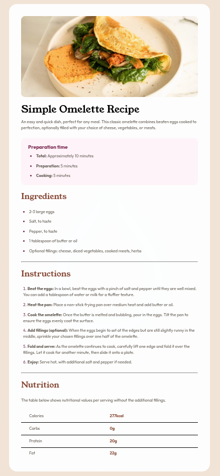

# Front-end Mentor - Recipe page solution

This is a solution to the
[Recipe page challenge on Frontend Mentor](https://www.frontendmentor.io/challenges/recipe-page-KiTsR8QQKm).
Frontend Mentor challenges help you improve your coding skills by building
realistic projects.

## Table of contents

- [Overview](#overview)
  - [The challenge](#the-challenge)
  - [Screenshot](#screenshot)
  - [Links](#links)
- [My process](#my-process)
  - [Built with](#built-with)
  - [What I learned](#what-i-learned)
- [Author](#author)

## Overview

### The challenge

Users should be able to:

- View the optimal layout for the page depending on their device's screen size
- See hover and focus states for all interactive elements on the page

### Screenshot

 

### Links

- Solution URL:
  [Solution](https://www.frontendmentor.io/solutions/recipe-page-solution-xxxxxxxx)
- Live Site URL:
  [https://frontendmentor-projects.pages.dev/](https://frontendmentor-projects.pages.dev/)

## My process

### Built with

- Semantic HTML5 markup
- CSS custom properties
- Table
- Astro
- Mobile-first workflow

### What I learned

I got more practice with styling HTML tables. Using `border-collapse: collapse;`
is key to getting clean borders. I also learned how to effectively style table
rows and cells individually, for example, by applying a border only to the
bottom of each cell to create a clean, modern-looking table.

```css
.recipe__table {
  border-collapse: collapse;
}

.recipe__table-cell,
.recipe__table-header {
  border-bottom: 1px solid black;
  padding-block: 0.75rem;
}
```

## Author

- Website - [Justin Scopelleti](https://justin-scopelleti.com/)
- Frontend Mentor - [@Kesmek](https://www.frontendmentor.io/profile/Kesmek)
