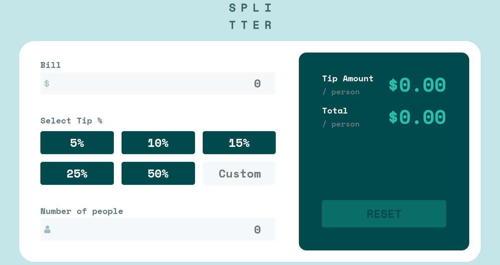

# Frontend Mentor - Tip calculator app solution

This is a solution to the
[Tip calculator app challenge on Frontend Mentor](https://www.frontendmentor.io/challenges/tip-calculator-app-ugJNGbJUX).
Frontend Mentor challenges help you improve your coding skills by building
realistic projects.

## Table of contents

- [Overview](#overview)
  - [The challenge](#the-challenge)
  - [Screenshot](#screenshot)
  - [Links](#links)
- [My process](#my-process)
  - [Built with](#built-with)
  - [What I learned](#what-i-learned)
- [Author](#author)

## Overview

### The challenge

Users should be able to:

- View the optimal layout for the app depending on their device's screen size
- See hover states for all interactive elements on the page
- Calculate the correct tip and total cost of the bill per person

### Screenshot



### Links

- Solution URL:
  [Add solution URL here](https://www.frontendmentor.io/solutions/)
- Live Site URL:
  [https://frontendmentor-projects.pages.dev/projects/tip-calculator-app/](https://frontendmentor-projects.pages.dev/projects/tip-calculator-app/)

## My process

### Built with

- Semantic HTML5 markup
- CSS custom properties
- CSS Grid & Container Queries
- Mobile-first workflow
- [Astro](https://astro.build/) - Web Framework
- TypeScript for interactivity and validation

### What I learned

This project was an excellent opportunity to practice building an interactive
calculator with proper form validation, state management, and accessible error
handling.

#### Form Validation with TypeScript

The calculator uses the browser's native Constraint Validation API with custom
error messages and accessible error display:

```typescript
const validateField = (field: HTMLInputElement): boolean => {
  if (!field.validity.valid) {
    const message = getCustomErrorMessage(field, fieldErrors);
    showFieldError(field, message);
    return false;
  }
  clearFieldError(field);
  return true;
};
```

This approach provides:

- **Native validation** - Leverages browser's built-in validation
- **Custom error messages** - User-friendly validation feedback
- **ARIA attributes** - `aria-invalid` and `aria-describedby` for screen readers
- **Real-time feedback** - Validates on input for immediate user feedback

#### Interactive Tip Selection

The calculator handles two input methods for tip selection (preset percentages
and custom input) with automatic mutual exclusion:

```typescript
// Clear custom input when radio selected
const tipRadios = document.querySelectorAll<HTMLInputElement>(".tip-radio");
tipRadios.forEach((radio) => {
 radio.addEventListener("change", () => {
  if (radio.checked) {
   tipInput.value = "";
   clearFieldError(tipInput, ".input-group", ".input-error");
   tip = Number(radio.value);
   calculateBill();
  }
 });
});

// Uncheck radios when typing in custom input
const uncheckRadios = (field: HTMLInputElement) => {
 const fieldset = field.closest(".input-group") as HTMLFieldSetElement;
 if (!fieldset) return;

 fieldset.querySelectorAll<HTMLInputElement>(".tip-radio").forEach((radio) => {
  radio.checked = false;
 });
};
```

#### State Management & Real-time Calculation

The calculator maintains state across three input values and updates results in
real-time:

```typescript
let total = 0,
  tip = 0,
  numPeople = 0;

const calculateBill = (): void => {
  if (total > 0 && numPeople > 0) {
    const tipAmountPerPerson = (total * tip) / 100 / numPeople;
    const totalPerPerson = total * (1 + tip / 100) / numPeople;

    tipPerPersonOutput.textContent = `$${tipAmountPerPerson.toFixed(2)}`;
    totalPerPersonOutput.textContent = `$${totalPerPerson.toFixed(2)}`;
  }
};
```

#### Container Queries for Responsive Layout

Used CSS Container Queries instead of media queries for truly component-based
responsive design:

```css
.calculator {
  container-type: inline-size;
}

@container (inline-size > 40rem) {
  .tips-container {
    grid-template-columns: repeat(3, 1fr);
  }
}
```

Key learnings:

- Form validation with Constraint Validation API
- Reusable validation utilities with TypeScript
- Accessible error handling with ARIA
- Managing interactive form state
- Real-time calculation updates
- Container queries for component-scoped responsive design
- CSS logical properties (inline-size, block-size)

## Author

- Website - [Justin Scopelleti](https://justin-scopelleti.com/)
- Frontend Mentor - [@Kesmek](https://www.frontendmentor.io/profile/Kesmek)
